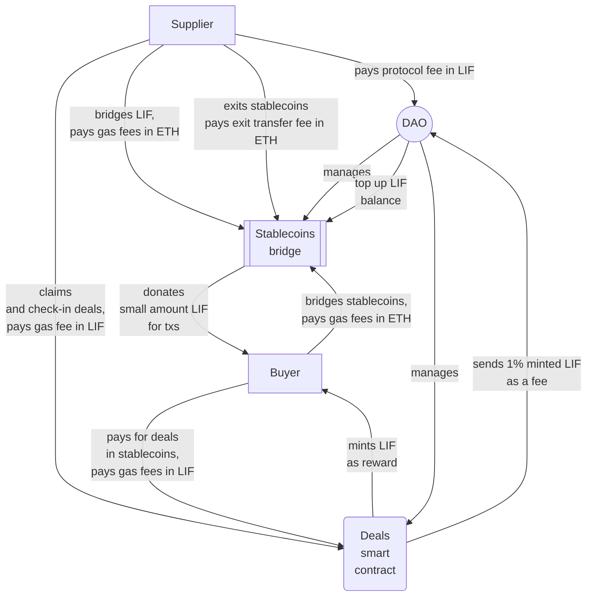

# The WindingTree market protocol tokenomics

This document defines top level vision of the LIF tokenomics of the WindingTree market protocol

## General points

- L3 with the LIF as a native token
- L3 chain nodes holders are getting profit in LIF from the gas fee of every transaction
- Every deal requires payment in one of the assets (stablecoins) supported by protocol. These stablecoins must be transferred from the external chain to L3 using the protocol bridge
- When someone moves stablecoins from an external chain to L3 the bridge will donate (or mint) in his address a proper small amount of LIF that should be enough to send at least one transaction on L3
- When the supplier claims the deal he will be charged a small protocol fee in LIF (fixed value per transaction). This fee will be sent to the DAO treasure
- When the claimed deal is `checked-in`, in the address of the buyer will be minted a proper amount of LIF tokens as a reward that depends on the deal value. This approach is under discussion yet because it requires adding asset price oracles to the protocol architecture. Another proposed approach is to peg the buyer rewards to the average amount of protocol fee collected in a certain period. Anyway, 1% of tokens minted during the reward are sent to the DAO treasure.

## Structure



## Workflow

Conventionally, the workflow can be divided into the following parts:

### LIF tokens bridging

- LIF tokens can be bridged from external chains to L3 without commission in equal value
- When LIF tokens are bridging the tx fees in ETH must be paid by the sender

### LIF tokens rewards

- On **every deal check-in** the protocol smart contract mints a proper amount of LIF tokens in address of the buyer (calculation formula is under discussion)
- 1% of rewarded LIF tokens is sending to the DAO

### Stablecoins tokens bridging (L1/L2 -> L3)

- Stablecoins tokens can be bridged from external chains to L3 without commission in equal value
- When stablecoins tokens are bridging the tx fees in ETH must be paid by the sender
- On each bridge transaction the sender will be credited with a small amount of LIF tokens in L3 that are enough to send at least one transaction. If the account of the sender already has this value it will not be credited
- After a bridging procedure will be finished the sender will be immediately able to start sending transactions in L3, stablecoins and LIF must be on his account in the L3

### L3 transactions

- Every transaction gas fee inside the L3 must be paid in the native token (LIF)
- Every `claim` transaction automatically charges the supplier's LIF deposit account the protocol fee that will be sent to the DAO treasure.

### LIF tokens exits (L3->L1/L2)

- When LIF tokens are moved to the bridge on L3, the tx fee in LIF must be paid by the sender
- When unlocked LIF tokens are withdrawn from the bridge contract in the target chain, the tx fees in ETH (or other L1/L2 native tokens) must be paid by the sender

> The bridge mechanics is still under discussion

### Stablecoins exits

- When stablecoins tokens are moved to the bridge on L3, the tx fee in LIF must be paid by the sender
- When unlocked stablecoins tokens are withdrawn from the bridge contract in the target chain, the tx fees in ETH (or other L1/L2 native tokens) must be paid by the sender.

## Testing

### Configuration

```bash
cp ./.env.example ./.env
```

### Test cases

```bash
yarn start:dev
```
