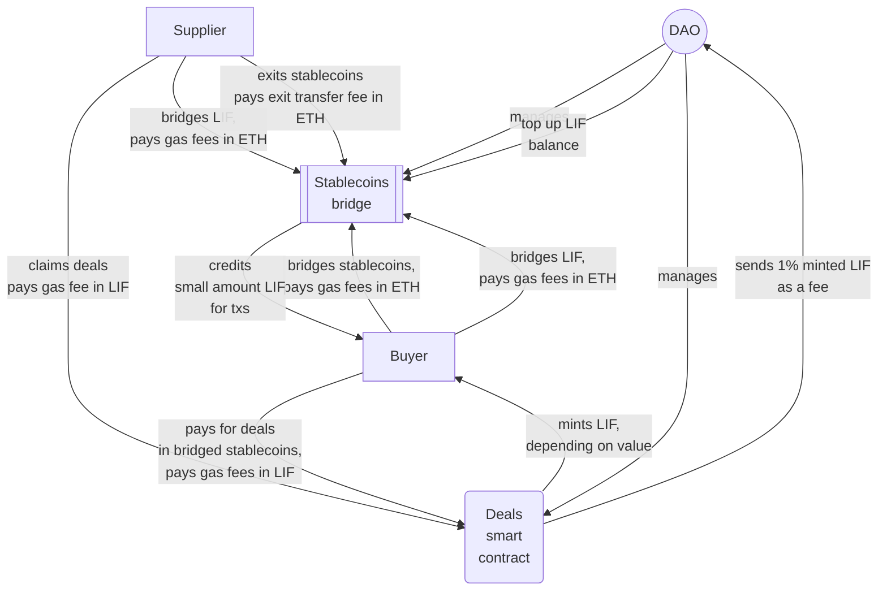

# The WindingTree tokenomics

This document defines top level vision of the LIF tokenomics of the WindingTree market protocol

## General idea

- L3 with the LIF as a native token
- (POS???) L3 chain nodes owners must participate the DAO and stake LIF
- Deals paid in stablecoins that must be moved to the L3 via the bridge
- Watchtower service that watches deals and recalculates average stablecoins/LIF conversion coefficients in relation to consumed gas fee
- When someone moves (bridges) stablecoins from the Mainnet to L3 the bridge will mint in his address a proper amount of LIF calculated using conversion coefficients

## Architecture



## Workflow

Conventionally, the workflow can be divided into the following parts:

### LIF tokens bridging

- LIF tokens can be bridged from the Mainnet to L3 without commission in equal value
- When LIF tokens are bridging the tx fees in ETH must be paid by the sender

### LIF tokens rewards

- On **every deal claim** the protocol smart contract calculating LIF reward using the following formula: reward = tx gas fee \* inflation / stablecoin value;
- `inflation` coefficient is managed by the DAO and dedicated to tuning the LIF token inflation (can be tuned to be deflated)
- 1% of rewarded LIF tokens is sending to the DAO

### Stablecoins tokens bridging (Mainnet -> L3)

- Stablecoins tokens can be bridged from the Mainnet to L3 without commission in equal value
- When stablecoins tokens are bridging from the Mainnet the tx fees in ETH must be paid by the sender
- After a bridging procedure will be finished the sender will be immediately able to start sending transactions in L3, stable coins and LIF must be on his account in the L3
- On every transaction with the bridge, the bridge credits the buyer with a small amount of LIF tokens to send at least one `deal` transaction. If the buyer account already has this amount of LIF tokens on his account it will not be credited

### L3 transactions

- Every transaction gas fee inside the L3 must be paid in the native token (LIF)

### LIF tokens exits (L3->Mainnet)

- When LIF tokens are moved to the bridge in the Mainnet, the tx fee in LIF must be paid by the sender
- When unlocked LIF tokens are withdrawn from the bridge in the Mainnet, the tx fees in ETH must be paid by the sender

### Stablecoins exits

- When stablecoins tokens are moved to the bridge in the Mainnet, the tx fee in LIF must be paid by the sender
- When unlocked stablecoins tokens are withdrawn from the bridge in the Mainnet, the tx fees in ETH must be paid by the sender.

## Testing

### Configuration

```bash
cp ./.env.example ./.env
```

### Test cases

```bash
yarn start:dev
```
